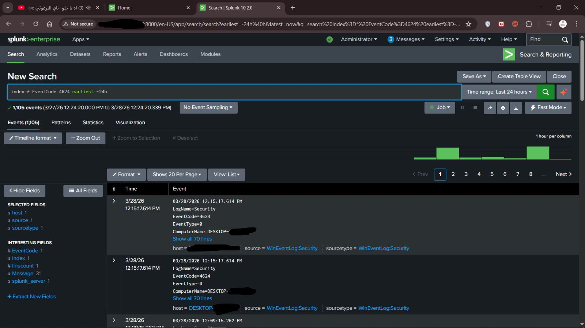

# SIEM Lab using Splunk

## Overview

Built a SIEM lab using Splunk to simulate SOC monitoring.

Logs were collected from a Windows endpoint and forwarded to a Splunk indexer on Ubuntu.

The focus was on:

* Log ingestion
* Detection
* Dashboard monitoring

---

## Architecture

* Windows Endpoint (Log Source)
* Splunk Universal Forwarder
* Splunk Indexer (Ubuntu)
* Splunk Web (Search & Dashboard)

---

## Data Collection

The lab focuses on collecting meaningful security data, including:

* Authentication events (login success/failure)
* User account activity
* Process execution

---

## Example Use Cases

* Failed login detection (brute force behavior)
* Monitoring user activity
* Observing suspicious process execution

---

## Dashboard

A basic SOC dashboard was created to visualize:

* Failed login attempts
* Successful logins
* User activity
* Timeline of events

---

## Screenshots

---

## Challenges

* Handling dynamic IP issues and ensuring stable connectivity
* Rebuilding the environment due to initial setup instability
* Troubleshooting missing logs (ingestion issues)
* Resolving index binding problems

---

## What I Learned

* Difference between log collection, ingestion, and indexing
* Importance of stable infrastructure in SIEM environments
* How detection is built on top of raw logs
* Understanding basic SOC workflows

---

## Project Structure

SIEM-Lab/
│
├── README.md
├── architecture.png
├── screenshots/
│   └── dashboard.png

---

## Notes

This repository contains high-level information only.
Configuration details and queries are intentionally omitted.

---

## Author

Cybersecurity enthusiast focused on SOC and SIEM technologies.
