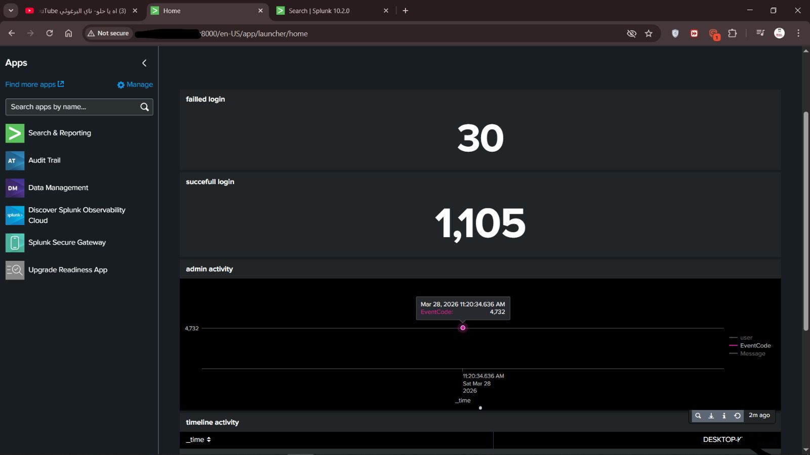

# siem-lab
# SIEM Lab using Splunk

## Overview

This project demonstrates a basic SIEM lab built using Splunk to simulate real-world security monitoring.

The lab focuses on collecting logs from a Windows endpoint, forwarding them to a Splunk server (Ubuntu), and analyzing security events.

---

## Architecture

* Windows Endpoint (Log Source)
* Splunk Universal Forwarder (Data Forwarding)
* Splunk Enterprise on Ubuntu (Indexer & Search)

---

## Key Capabilities

* Log collection from Windows systems
* Data ingestion into Splunk
* Basic detection use cases (e.g., failed logins)
* Security monitoring through dashboards

---

## Example Use Cases

* Monitoring failed login attempts
* Tracking user activity
* Observing process execution

---

## Challenges

* Handling dynamic IP issues and ensuring stable connectivity
* Rebuilding the environment due to initial setup instability
* Understanding data ingestion flow in Splunk
* Resolving log visibility issues caused by index binding

---

## What I Learned

* Difference between log collection, ingestion, and indexing
* Importance of stable infrastructure in SIEM environments
* How detection is built on top of raw logs
* Real-world SOC workflow concepts

---

## Project Structure

```
SIEM-Lab/
│
├── README.md
├── architecture.png
├── screenshots/
│   └── dashboard.png
```

---

## Notes

This repository contains high-level information only.
Configuration details and queries are intentionally omitted.

## Screenshots



---

## Author

Cybersecurity enthusiast focused on SOC and SIEM technologies.
